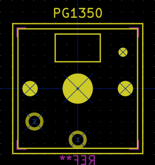
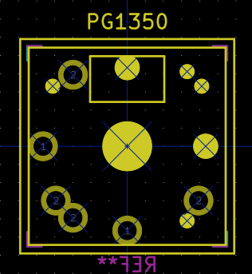

an open source [KiCad](http://kicad-pcb.org) library of mechanical keyboard switch footprints for your [open source hardware](https://www.oshwa.org/definition/) keyboard designs

## Switches
### Kailh Low Profile "Choc"

Footprint | Description/notes | Preview
--------- | ----------------- | -------
PG1350 | Just a plain one-sided mount for [Kailh PG1350](http://kailh.com/en/Products/Ks/CS/) switches | 
PG1350_reversible | Enables the switch to be mounted on either side of the PCB, similar to the switch mounts on the original Ergodox PCBs | 
PG1350_rotatable | Enables the switch to be mounted on either side of the PCB *and* optionally rotated 90° by the person assembling the board. This option is intended to allow the board assembler to accomodate keycaps that only fit in a particular orientation. | 

The plate footprint and outer edge of the switches themselves, as well as the LED mount area, are marked on the layer Eco2.User

------------------------

This work is licensed under a [Creative Commons Attribution-ShareAlike 4.0 International License](http://creativecommons.org/licenses/by-sa/4.0/).