an open source [KiCad](http://kicad-pcb.org) library of mechanical keyboard switch footprints for your [open source hardware](https://www.oshwa.org/definition/) keyboard designs

## Switches

### Cherry MX style and compatibles

#### Direct solder

Footprint | Description/notes | Preview
--------- | ----------------- | -------
SW_MX | One-sided mount for any MX-compatible switches. Supports PCB mount switches. | 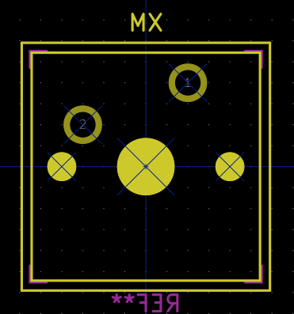
SW_MX_reversible | Enables any MX-compatible switches to be mounted on either side of the PCB, similar to the switch mounts on the original Ergodox PCBs. Supports PCB mount switches. | 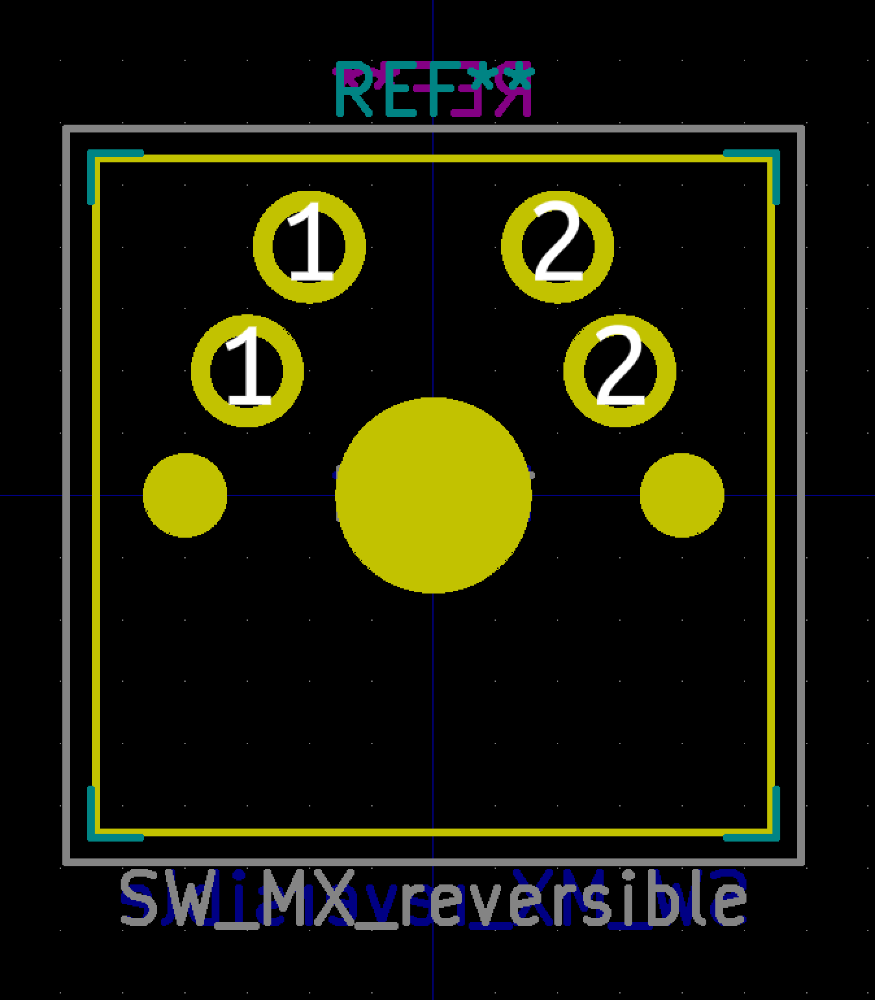
SW_MX_reversible_minimal | A variant of SW_MX_reversible with condensed reference marking and no PCB mount holes | 

#### Hot-swap socket mount

Footprint | Description/notes | Preview
--------- | ----------------- | -------
Kailh_socket_MX | Hot-swappable socket mount for MX-compatible switches using [Kailh MX sockets](https://novelkeys.xyz/collections/miscellaneous/products/kailh-pcb-sockets) | 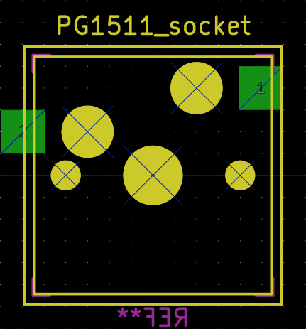
Kailh_socket_MX_reversible | Enables attaching hot-swappable MX-compatible socket mount on either side of the PCB. Note that the switch will be "upside-down" when mounted on the back side of the PCB, which may interfere with Cherry Profile keycaps. | 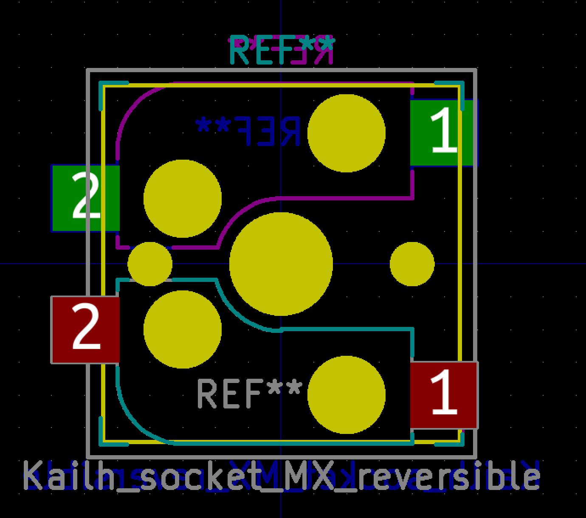
Kailh_socket_MX_platemount | Hot-swappable socket mount for MX-compatible plate mount (instead of 3 plastic pins, it only have 1 plastic pin on the center) switches using [Kailh MX sockets](https://novelkeys.xyz/collections/miscellaneous/products/kailh-pcb-sockets) **It doesn't support PCB mounting option!** | 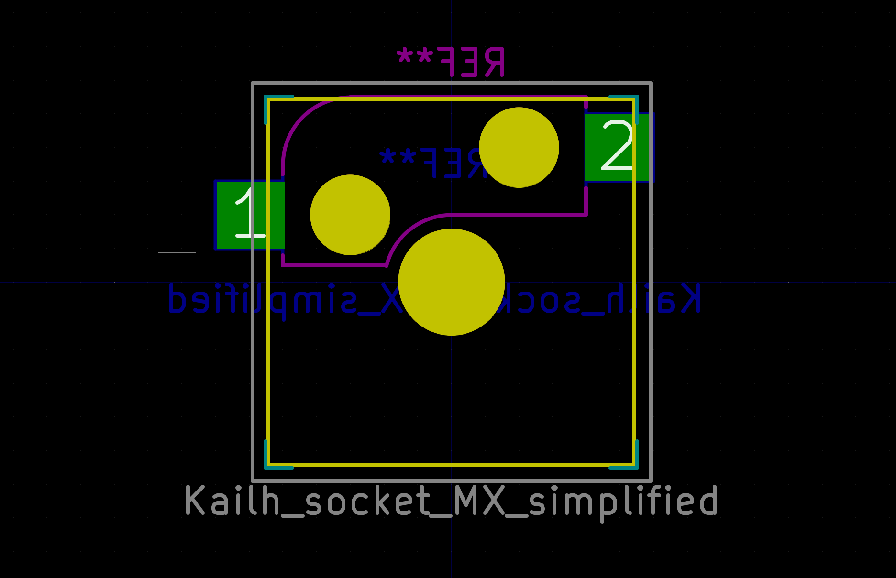
Kailh_socket_MX_reversible_platemount | Enables attaching hot-swappable MX-compatible socket mount on either side of the PCB for plate mount (instead of 3 plastic pins, it only have 1 plastic pin on the center) switches. Note that the switch will be "upside-down" when mounted on the back side of the PCB, which may interfere with Cherry Profile keycaps. **It doesn't support PCB mounting option!** | 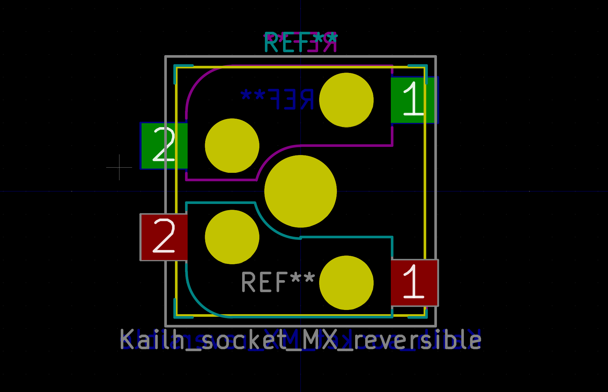

#### Flexible mounting (choose socket or direct soldered when assembling)

Footprint | Description/notes | Preview
--------- | ----------------- | -------
Kailh_socket_MX_optional | Enables mounting MX-compatible switches using either through-hole soldering or the hot-swappable mount. Note that the switch will be "upside-down" when mounted in the socket, which may interfere with Cherry Profile keycaps. | 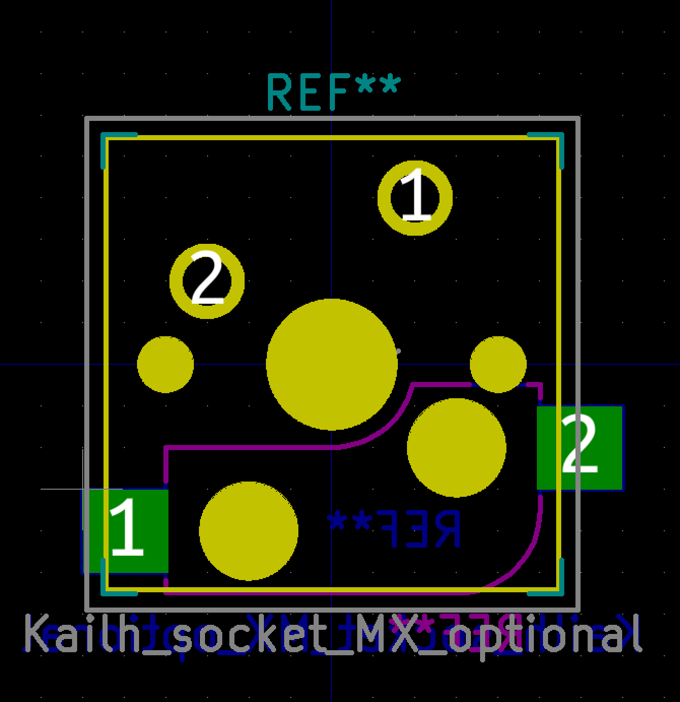
Kailh_socket_MX_optional_reversible | Enables mounting MX-compatible switches using either through-hole soldering or the hot-swappable mount, on either side of the PCB. Note that the switch orientation will be reversed depending on which side of the PCB it is mounted on, which may affect aesthetics if the case leaves the switches visible, as well as possible interference with Cherry Profile keycaps. | 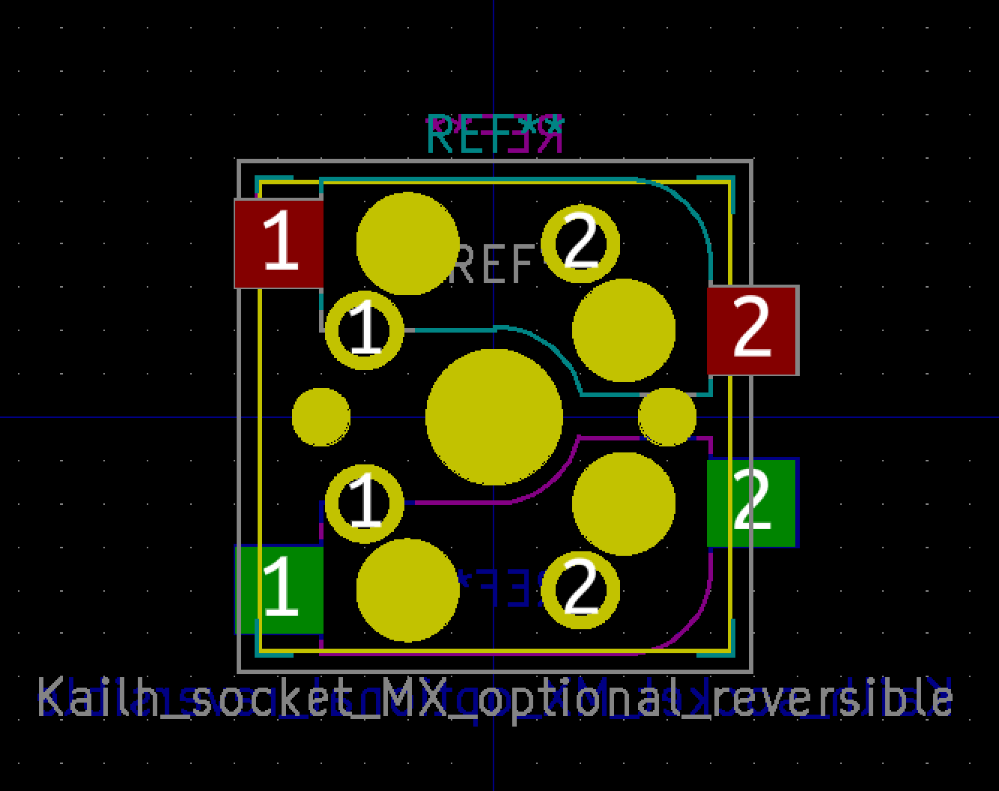
Kailh_socket_MX_optional | Enables mounting MX-compatible plate mount (instead of 3 plastic pins, it only have 1 plastic pin on the center) switches using either through-hole soldering or the hot-swappable mount. Note that the switch will be "upside-down" when mounted in the socket, which may interfere with Cherry Profile keycaps. **It doesn't support PCB mounting option!** | 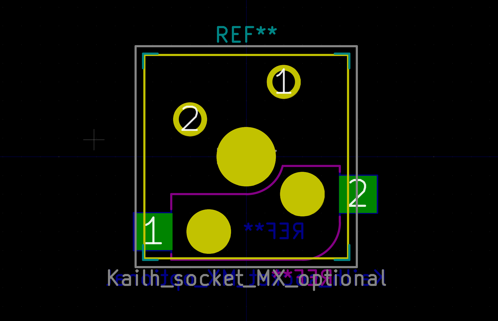
Kailh_socket_MX_optional_reversible | Enables mounting MX-compatible plate mount (instead of 3 plastic pins, it only have 1 plastic pin on the center) switches using either through-hole soldering or the hot-swappable mount, on either side of the PCB. Note that the switch orientation will be reversed depending on which side of the PCB it is mounted on, which may affect aesthetics if the case leaves the switches visible, as well as possible interference with Cherry Profile keycaps. **It doesn't support PCB mounting option!** | 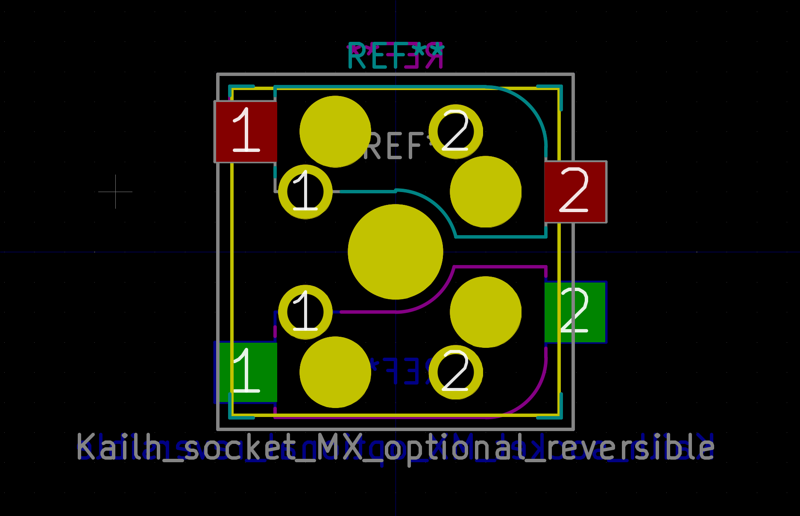

### Kailh Low Profile "Choc"

#### Direct solder

Footprint | Description/notes | Preview
--------- | ----------------- | -------
SW_PG1350 | Just a plain one-sided mount for [Kailh PG1350](http://kailh.com/en/Products/Ks/CS/) switches | 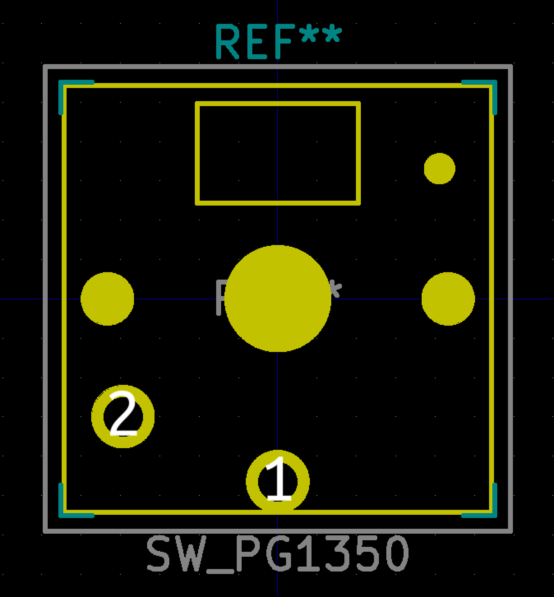
SW_PG1350_reversible | Enables the switch to be mounted on either side of the PCB, similar to the switch mounts on the original Ergodox PCBs | 
SW_PG1350_reversible_rotatable | Enables the switch to be mounted on either side of the PCB *and* optionally rotated 90° by the person assembling the board. This option is intended to allow the board assembler to accomodate keycaps that only fit in a particular orientation. | 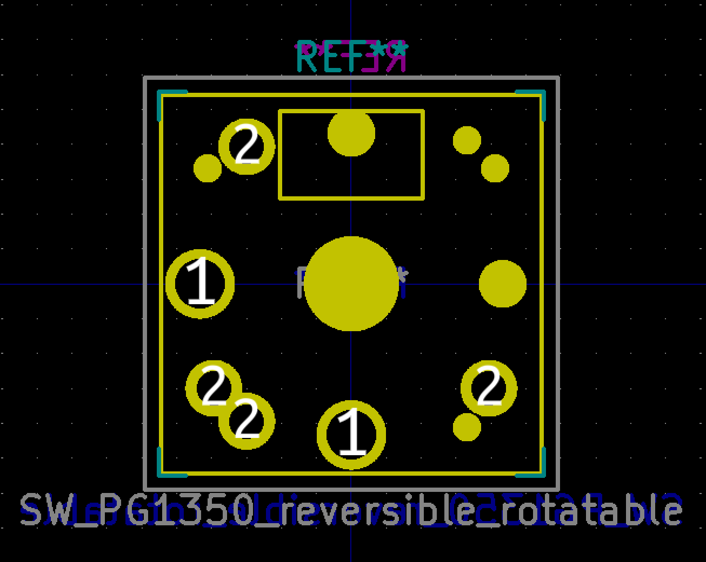

#### Hot-swap socket mount

Footprint | Description/notes | Preview
--------- | ----------------- | -------
Kailh_socket_PG1350 | Hot-swappable socket mount for [Kailh Choc PCB Sockets](https://novelkeys.xyz/collections/miscellaneous/products/kailh-pcb-sockets?variant=3762779357224) | 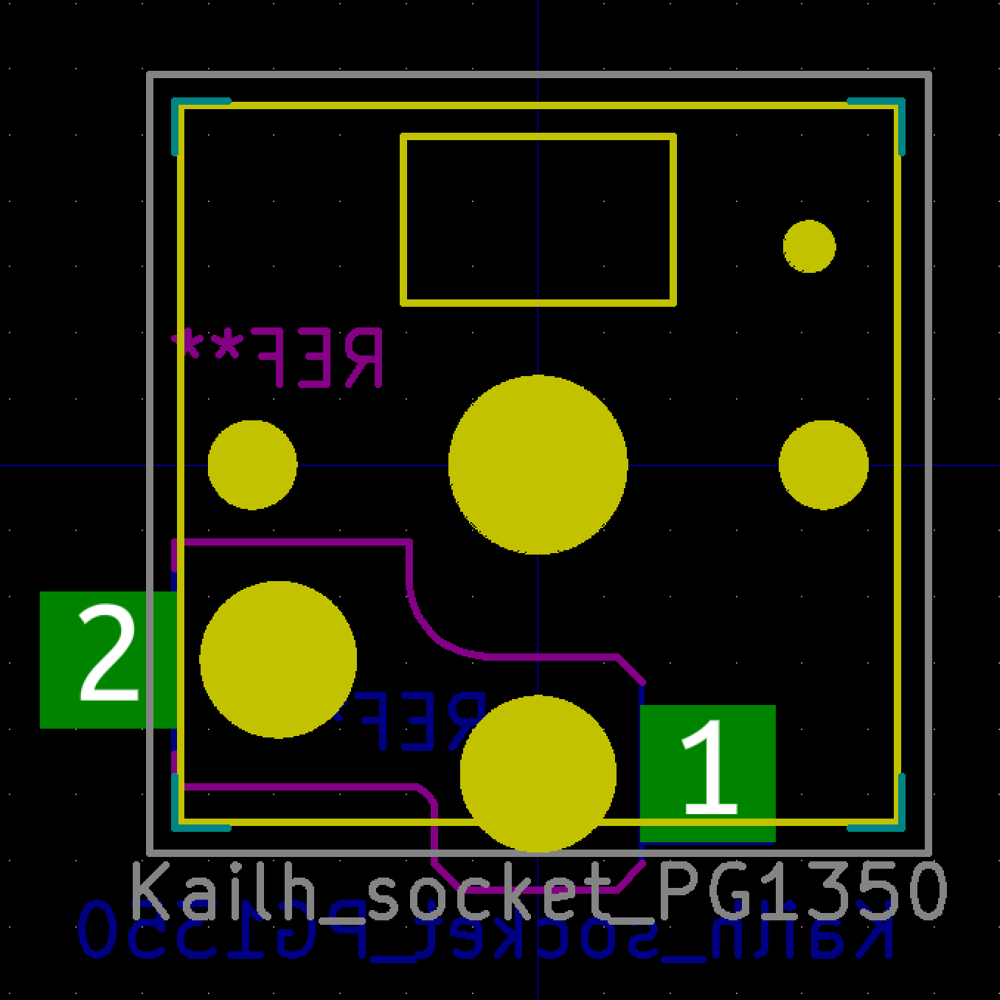
Kailh_socket_PG1350_reversible | Enables attaching hot-swappable socket mount on either side of the PCB | 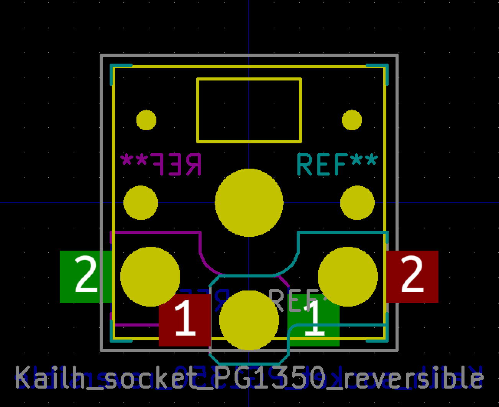

#### Flexible mounting (choose socket or direct soldered when assembling)

Footprint | Description/notes | Preview
--------- | ----------------- | -------
Kailh_socket_PG1350_optional | Enables switch to be attached with either through-hole soldering or hot-swappable mount | 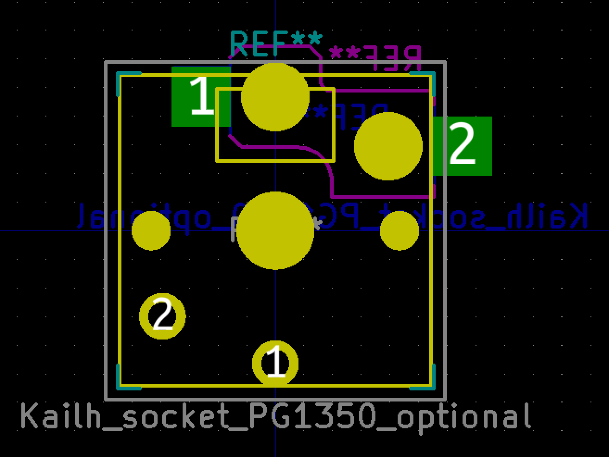
Kailh_socket_PG1350_optional_reversible | Enables switch to be attached on either side of the PCB with either through-hole soldering or hot-swappable mount | 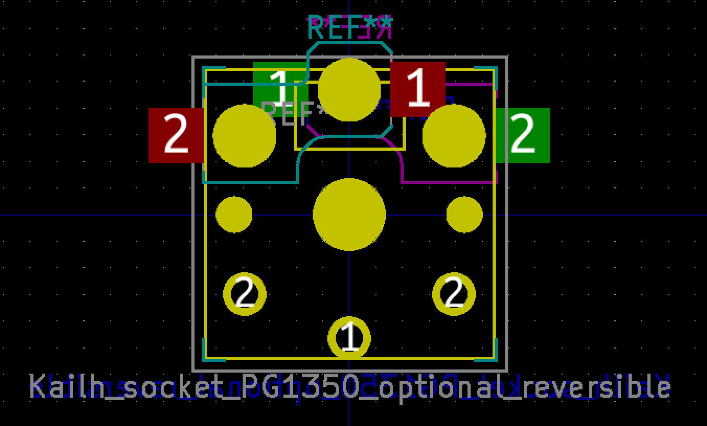

### Notes for switch footprints

The square in the layer F.Fab is meant to represent the outline of the switch as it would be mounted on the board. This is a change from older versions of this library but matches the KiCad library convention.

The plate footprint and LED mount area are marked on the layer Eco2.User. The plate footprint markings, especially for MX, are meant to show the overall dimensions of the cutout, not to be detailed enough to cut a plate from.

For all socket-mountable (and flexible-mount) footprints here, the socket is placed on the __back__ of the footprint (i.e. the switch ends up mounted on the front if the footprint is placed on the front of the board). This goes against KiCad library standards for SMD parts but is done for consistency between the direct-mount and socket-mount footprints in this library. Be aware of this when placing the footprints on your board.

The fab layer and silkscreen for the socket footprints contain the [standard](https://kicad-pcb.org/libraries/klc/#f5) information for *both* installing the switch on the front of the PCB *and* installing the socket on the back. Likewise, reversible footprints show the information for installation on *both* sides. Particularly with flexible-mount footprints, be careful that this doesn't cause confusion for anyone assembling your board – you may want to delete the extra silkscreen and fab info depending on your preferred assembly method or at least mention this in any assembly documentation you provide for your PCB.

## Other included components

Footprint | Description/notes | Preview
--------- | ----------------- | -------
Stabilizer_MX_2u | Mounting holes for a 2u PCB-mount stabilizer for MX-style switches | 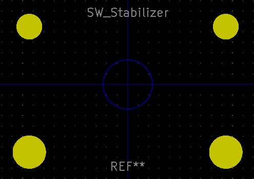

------------------------

This work is licensed under a [Creative Commons Attribution-ShareAlike 4.0 International License](http://creativecommons.org/licenses/by-sa/4.0/).
